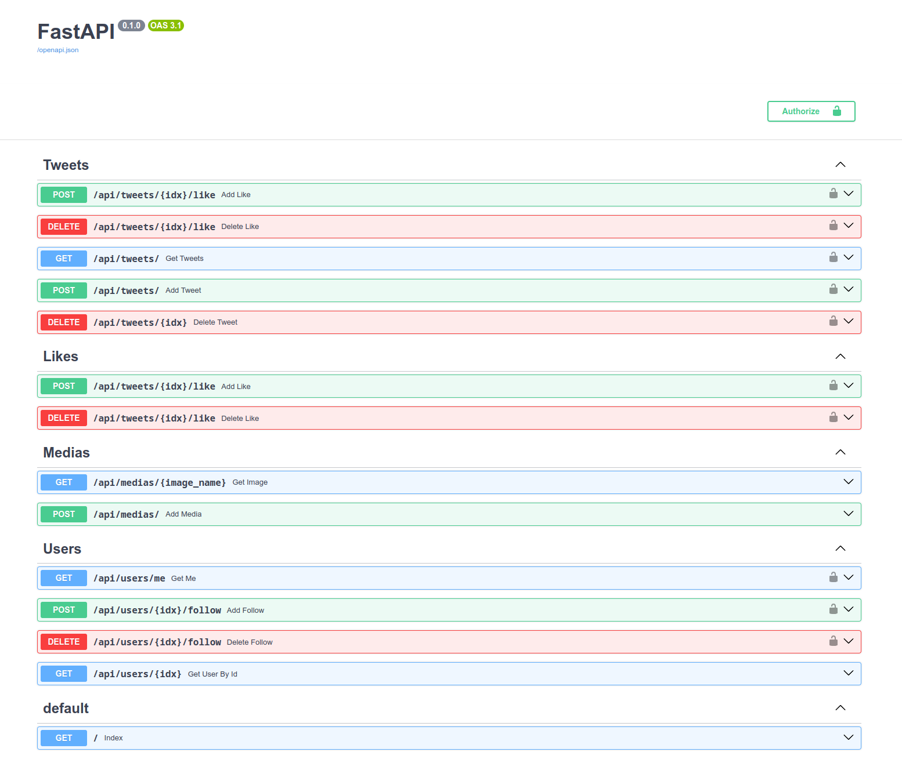
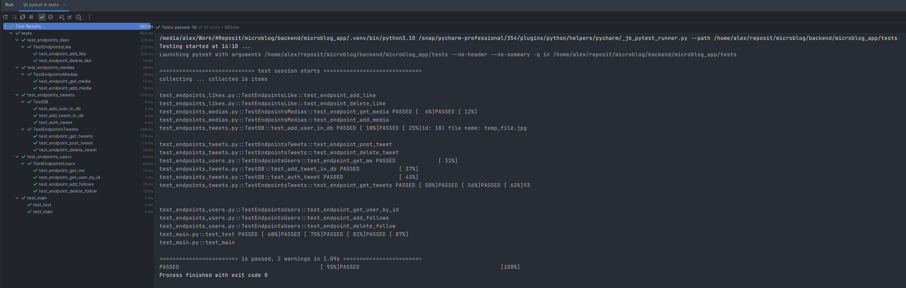

# Сервис микроблогов #

В этом проекте реализован бэкенд сервиса микроблогов.

## Функциональные требования: ##
1. Пользователь может добавить новый твит.
2. Пользователь может удалить свой твит.
3. Пользователь может зафоловить другого пользователя.
4. Пользователь может отписаться от другого пользователя.
5. Пользователь может отмечать твит как понравившийся.
6. Пользователь может убрать отметку «Нравится».
7. Пользователь может получить ленту из твитов отсортированных в порядке убывания 
по популярности от пользователей, которых он фоловит.
8. Твит может содержать картинку.

## Нефункциональные требования: ##
1. Систему должно быть просто развернуть через Docker Compose.
2. Система не должна терять данные пользователя между запусками.
3. Все ответы сервиса должны быть задокументированы через Swagger.

## Документация ##
Документация доступна после запуска приложения по адресу http://localhost:5500/docs#/

## Запуск приложения ##
1. Переименовать файл `example.env_docker` в `.env_docker`
2. В файле `.env_docker` заполнить данные
3. Выполнить `docker compose up`
4. Графический клиент pgAdmin для управления БД доступен по адресу: http://0.0.0.0:15432
5. Для заполнения БД тестовыми данными необходимо в папке backend/microblog_app/backups запустить скрипт `restore_bd.sh`

## Тестирование приложения ##
Для тестирования приложения необходимо запустить контейнер с тестовой БД 
для этого:
1. В папке /tests выполнить команду `docker-compose up`
2. В папке /app выполнить команду `alembic upgrade head`
3. В папке /backups выполнить команду `restore_bd.sh`
4. В папке /app выполнить команду `pytest -v -s ../tests`

### Результаты выполнения теста ###

## Технологический стэк: ##
1. Poetry 1.5
2. Python 3.10
3. FastAPI 0.103
4. PostgreSQL 16.0
5. SQLAlchemy 2.0
6. uvicorn 0.23
7. alembic 1.12
8. Nginx 1.25
9. Docker Compose